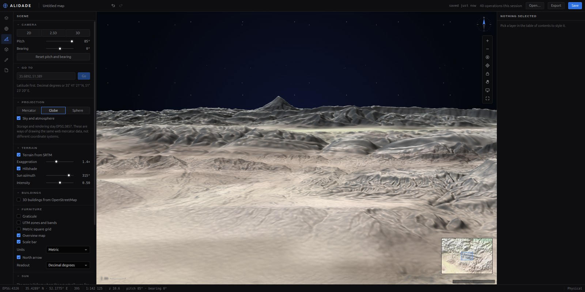
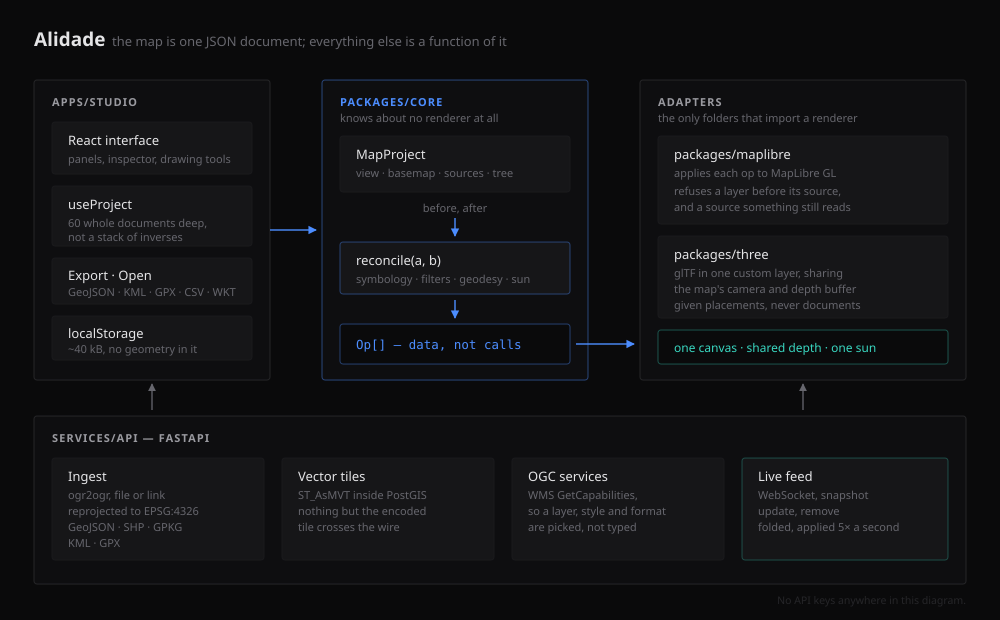
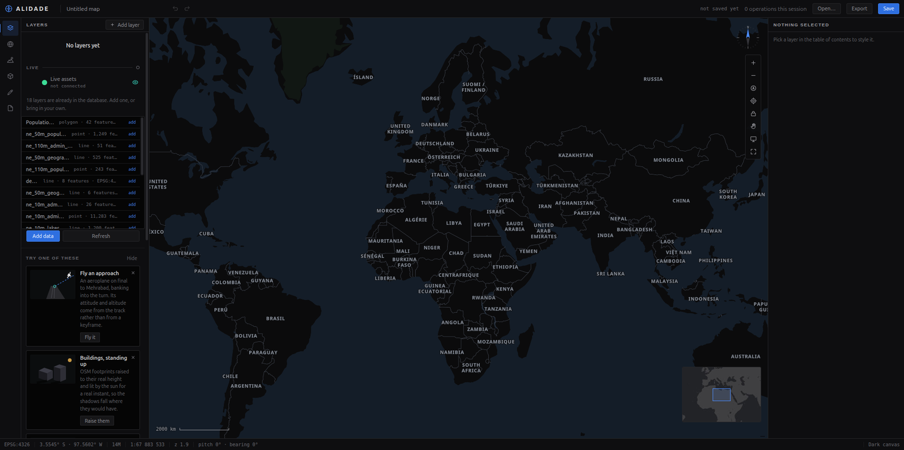
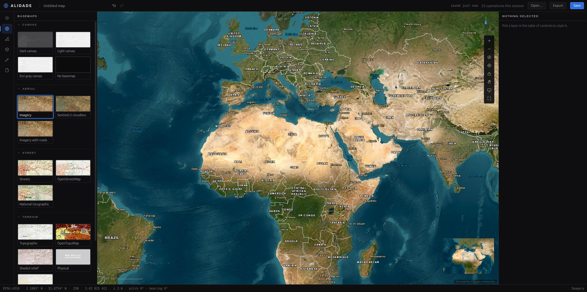
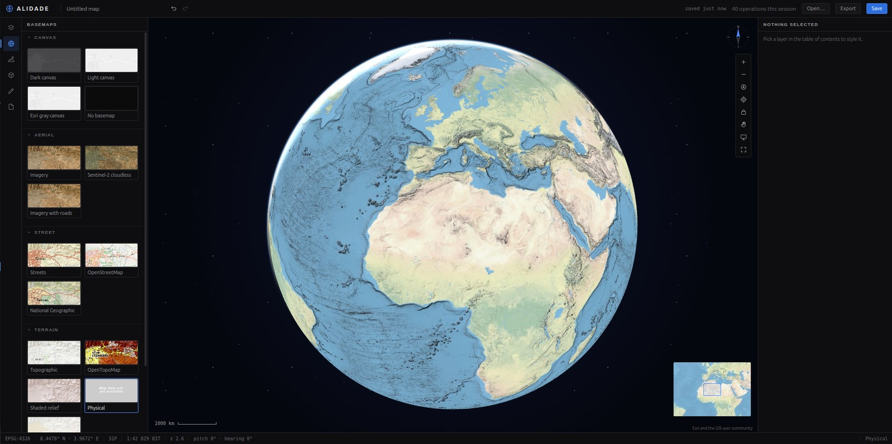
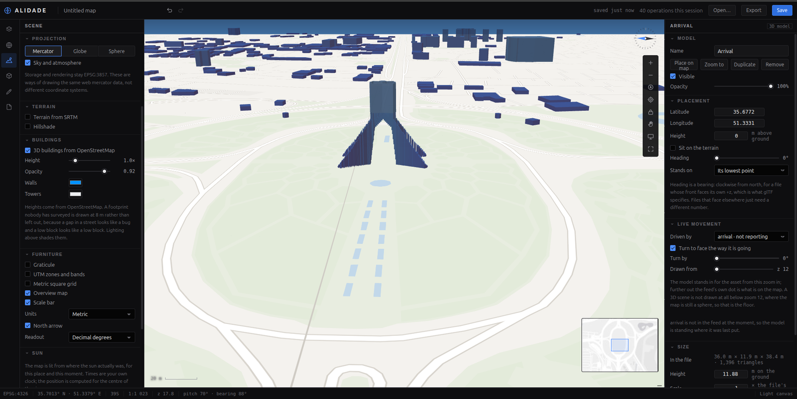
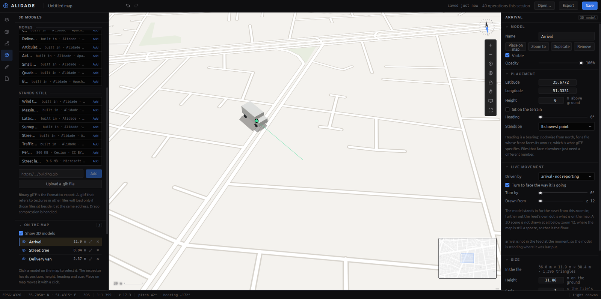
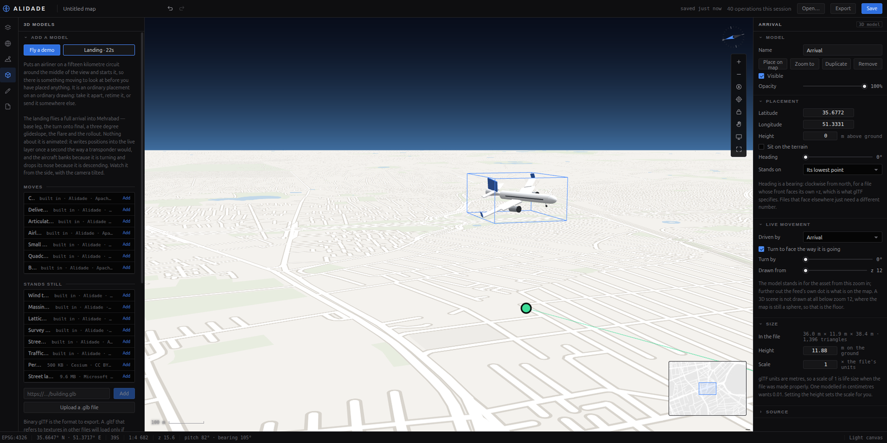
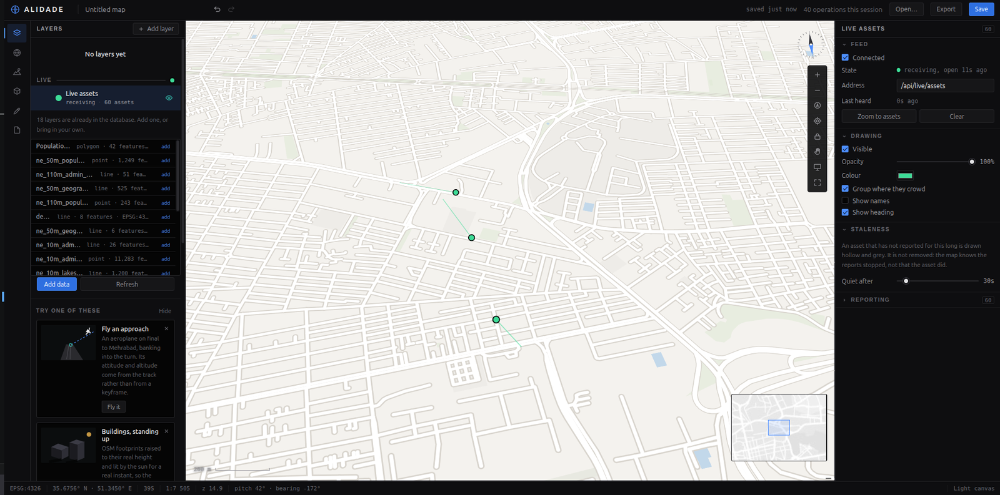
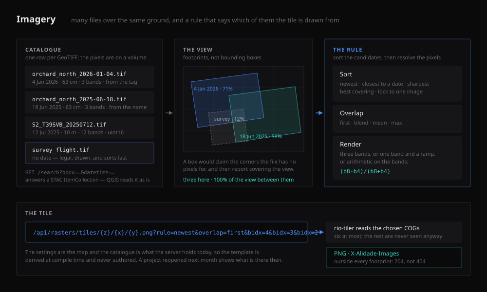

<div align="center">

# Alidade

**An open-source Web-GIS platform.**
PostGIS vector tiles, satellite imagery, full symbology, 3D models on the terrain,
and a real-time asset layer. No API keys anywhere.

[](https://github.com/aysanz/alidade/actions/workflows/ci.yml)
[](LICENSE)
[](#no-api-keys)



</div>

---

## What it is

The map is one JSON document. The core diffs two versions of it and emits a list of
operations; an adapter applies those operations to MapLibre. Editing the document
changes the map — and swapping the basemap does not destroy your layers.

That one decision is why undo is sixty whole documents deep, why a drawing survives
a basemap swap, and why the renderer could be replaced without touching the model.

```
packages/core        the arithmetic  ·  knows nothing about any renderer
packages/maplibre    the only folder that knows MapLibre exists
packages/three       the only folder that knows three.js exists
apps/studio          React client
services/api         FastAPI: ingest, vector tiles, imagery, WMS, live feed
```



## Features

| | |
|---|---|
| **Data in** | Drop a GeoJSON, zipped Shapefile, GeoPackage, KML or GPX — reprojected by ogr2ogr into PostGIS and served back as vector tiles in the same request. Or paste a link and GDAL reads it over HTTP. Or point at a WMS and pick a layer from GetCapabilities. |
| **Imagery** | GeoTIFFs converted once to Cloud-Optimised GeoTIFFs and indexed by their real footprint. Tiles are mosaicked on demand under a rule you choose — newest, closest to a date, sharpest, best covering, or one locked image — with band selection, stretch and band maths as query parameters rather than as decisions frozen at import. |
| **Symbology** | Single, graduated and categorised, with markers, labels and per-layer scale ranges. |
| **Filters** | A filter is a structure, not a string, so one filter compiles two ways: a renderer expression and parameterised SQL. The inspector will show you the SQL. |
| **Identify** | Click a feature for its attributes, or the imagery for the pixel values under the cursor. The attribute table pages, searches, sorts and hides columns, and highlights on the map what you select in it. |
| **2D · 2.5D · 3D** | Three projections including a real globe, terrain and hillshade from open elevation tiles, and OSM building footprints raised to their real height. |
| **3D models** | glTF placed the way a surveyor states it — position, height, bearing, scale — standing on the terrain, lit by the real sun for a real instant, casting real shadows. One model can be placed at every point of a layer. |
| **Live assets** | Positions over a WebSocket as an ordinary row in the table of contents. Assets that go quiet are drawn hollow, not deleted. A model can stand in for one and take its heading, climb and bank from the reports. |
| **Drawing** | Geodesic measurement, buffers, snapping, vertex editing. Exports to GeoJSON, KML, GPX, CSV or WKT — and reads all of them back. |
| **Chrome** | Graticule, UTM and metric grids, overview map, scale bar in three unit systems, coordinate readout in DD, DMS or UTM, bookmarks. |

## What it looks like

<table>
<tr>
<td width="50%"><br><sub><b>A fresh install.</b> The database ships empty, and the panel says what to do about it rather than hiding it.</sub></td>
<td width="50%"><br><sub><b>Basemaps, none of which need a key.</b> Swapping one does not disturb your layers.</sub></td>
</tr>
<tr>
<td><br><sub><b>A real globe</b>, not a picture of one — and a sphere at every zoom if you ask for one.</sub></td>
<td><br><sub><b>Footprints raised to their real height</b>, lit from where the sun actually was.</sub></td>
</tr>
<tr>
<td><br><sub><b>glTF on the map</b>, sized in metres, standing on the terrain and sharing the map's depth buffer.</sub></td>
<td><br><sub><b>Fly a landing.</b> The aircraft banks because it is turning, not because a keyframe said so.</sub></td>
</tr>
<tr>
<td><br><sub><b>A live fleet over a WebSocket</b>, with a connection light, because a stopped feed and a still fleet look identical.</sub></td>
<td><br><sub><b>Imagery.</b> A schematic rather than a screenshot: what is on the map is whatever you loaded. See <a href="docs/imagery.md">the imagery notes</a>.</sub></td>
</tr>
</table>

## Run it

```bash
cp .env.example .env

# --env-file matters: compose looks for .env next to the compose file, not here.
docker compose --env-file .env -f deploy/docker-compose.yml up -d --build

# Install from the repository root. The studio depends on two workspace packages,
# so installing inside apps/studio cannot see them.
pnpm install
pnpm dev
```

- Studio — <http://localhost:5173>
- API health — <http://localhost:8000/api/health>
- Live feed — `ws://localhost:8000/api/live/assets`, switched on from the **Live assets** row
- Postgres — host port **5433**, because 5432 is usually already taken

The database ships **empty**. There is no seeded demo layer: one cannot be deleted from
the studio, it comes back on every fresh volume, and it makes an install that has
nothing in it look like it already has data. Get data in through **Add data**, or load
straight into PostGIS:

```bash
./data/seed.sh wards.gpkg
```

Two things live on volumes rather than in the database, because they are files:
uploaded `.glb` models and converted imagery. A single satellite scene is a couple of
hundred megabytes, so give the imagery volume room before loading a folder of them.

For a server rather than a laptop, `deploy/docker-compose.prod.yml` runs images
built in CI instead of building anything locally, and publishes nothing but
Caddy. See [deployment](docs/deployment.md).

## No API keys

Nothing here needs one, and that is a constraint rather than a boast: a demo that dies
when someone's free tier changes is worse than a demo with fewer basemaps. The canvases
and the buildings are [OpenFreeMap](https://openfreemap.org), the imagery and terrain
styles are Esri, and the elevation is Mapzen terrarium.

## Tests

```bash
pnpm test        # 585 tests in 37 files, Node only: no browser, no WebGL
pnpm typecheck
pnpm build

cd services/api && pytest    # 70 more; 55 of them want no database at all
```

CI runs the API twice on purpose: once with nothing but Python, for the parsing, the
naming rules, the live feed and every imagery decision that is arithmetic on a
`gdalinfo` document; and once against a real PostGIS with `data/init/` loaded, for the
tiles and the registry.

Core tests assert on the operation array the reconciler emits for a given pair of
project states, so slot ordering, classification, filter compilation and the imagery
rules are all tested without rendering anything. Adapter tests use a fake renderer that
records calls and refuses the same things a real one refuses. Nothing in the suite
touches a GPU.

`packages/core/tests/regressions.test.ts` holds one test per defect that has been
fixed, named after the symptom rather than the cause.

## Documentation

- **[Design notes](docs/design-notes.md)** — why each subsystem is built the way it is,
  at length: the document model, geodesic drawing, the sun, the live feed's contract.
- **[Imagery](docs/imagery.md)** — the GeoTIFF catalogue, footprints, dates, mosaic
  rules and band maths, and what the endpoints answer.
- **[Imagery prior art](docs/imagery-prior-art.md)** — TiTiler, STAC, mosaic datasets
  and EO Browser: what the field already does, what was taken from it, and what is left.
- **[Deployment](docs/deployment.md)** — production on a small VPS: images built in
  CI, Caddy for TLS, tile caching, and the parts that only fail once you are live.
- **[Contributing](CONTRIBUTING.md)**

## Licence

Apache-2.0.
